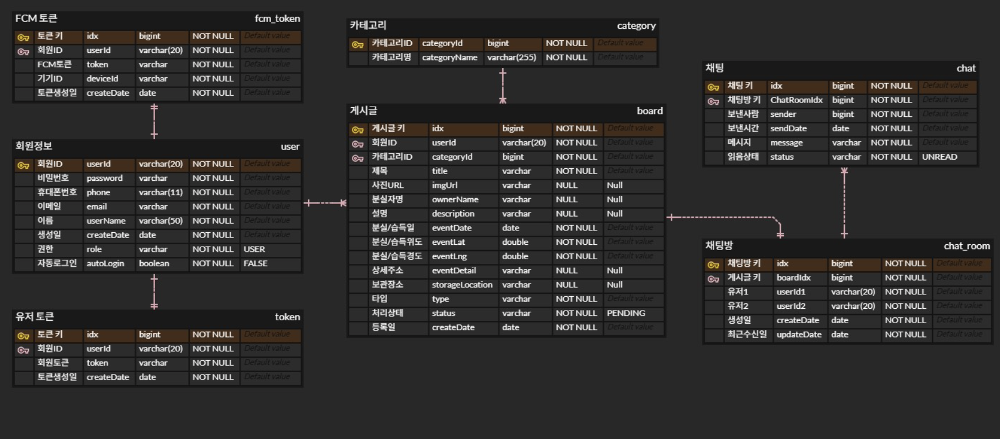

# 📱 JUBDA (Lost & Found)
분실물과 습득물을 관리하는 모바일 기반 서비스입니다.  
Spring Boot 서버와 Android 앱을 연동하여 사용자가 분실물 등록, 조회, 위치 확인을 할 수 있습니다.

---

## 💡 프로젝트 개요
분실물 신고와 습득물 등록 과정을 간소화하기 위해 기획된 서비스입니다.  
지도와 이미지 업로드 기능을 통해 시각적 정보를 제공하고,  
서버–앱 간 데이터 통신 구조를 직접 설계했습니다.

---

## ⚡ 개발 기간
2025.08.11 ~ 2025.08.22

---

## 🛠 기술 스택
- **Back-end** : Java 17 · Spring Boot · JPA · MySQL  
- **Android** : Kotlin · Retrofit2 · Glide · Naver Map  
- **Tools** : IntelliJ · Android Studio · GitHub · SourceTree  

---

## 🧩 담당 역할
- **Back-end Development**  
  - 데이터베이스 모델링 및 API 설계  
  - 분실물/습득물 CRUD 구현  
  - Retrofit 통신 구조 설계 및 응답 포맷 정의  
  - 지도 연동 및 이미지 처리 로직 구축  

---

## 🧱 ERD

---

## 💭 프로젝트를 통해 배운 점
웹 프로젝트와 달리 모바일 환경에서의 요청/응답 구조를 직접 설계하면서  
**API 응답 포맷, DTO 구조, 직렬화 처리**의 중요성을 실감했습니다.  
지도, 이미지 등 다양한 데이터 형태를 처리하며 백엔드의 확장성과 안정성을 고민하게 되었습니다.
